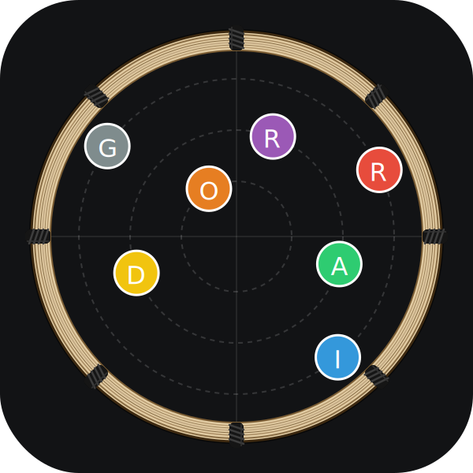

# 🥁 O Girador

> **O Sequenciador de Ritmos de Maracatu de Baque Virado interativo no seu navegador.**
> **Le séquenceur de rythmes de Maracatu de Baque Virado interactif dans votre navigateur.**

<div align="center">
  
</div>

---

## 🇧🇷 O Girador (Português)

### Sobre O Girador
**O Girador** é uma ferramenta gratuita e interativa dedicada ao estudo, à composição e à prática do **Maracatu de Baque Virado** (patrimônio imaterial de Pernambuco, Brasil). Ele simula um *bloco de maracatu* completo (Alfaia, Caixa, Gonguê, Agbê, Mineiro e Vozes) diretamente na web.

Com uma identidade visual única inspirada na literatura de **Cordel** e na **Xilogravura**, O Girador une a tradição percussiva com os recursos modernos do áudio digital (Web Audio API / Tone.js).

### ✨ Recursos Principais
#### 🥁 1. A Roda de Maracatu
* **Visualização Circular**: Veja os instrumentos tocando em tempo real em um círculo concêntrico dinâmico, simulando o posicionamento dos percussionistas na Roda.
* **Baguete de Leitura**: Uma linha rotativa indica visualmente a posição rítmica exata do pulso atual.

#### 🎞️ 2. Sequenciador Linear & Modo Song (Arranjo)
* **Arranjo Linear**: Organize e estruture suas composições ao longo do tempo (compasso por compasso) com uma visualização horizontal fluida.
* **Assinatura Rítmica por Compasso**: Defina assinaturas rítmicas diferentes de maneira independente para cada compasso (**4/4, 3/4, 2/4, 6/8 ou 12/8**).
* **BPM por Compasso & Rampas de Tempo (Aceleração / Arrasto)**: Crie acelerações e desacelerações de tempo contínuas e perfeitamente fluidas de uma medida a outra (uma dinâmica essencial no maracatu).
* **Volume por Compasso & Fades**: Controle o volume (0% a 100%) de cada compasso individualmente com transições imediatas ou progressivas (Fade In / Fade Out).
* **Modo Song**: Crie múltiplos padrões (patterns) para cada instrumento e escolha qual padrão deve ser tocado em cada compasso, ou adicione silêncio.

#### 🎛️ 3. Escultura de Som por Passo (Micro-timing & Decay)
* **Volume Individual**: Controle a dinâmica e a acentuação exata de cada batida.
* **Decay / Ressonância**: Controle a duração da nota e a ressonância de cada tambor (abafado ou sustentado).
* **Micro-timing**: Atrase ou adiante ligeiramente o tempo físico de batidas individuais para dar um "suingue" mecânico personalizado. O quadrado de passo se desloca visualmente na tela de acordo com a alteração!
* **Swing Maracatu (≈)**: Algoritmo interno que injeta micro-timing no tempo da Caixa para reproduzir o balanço ("gingado") tradicional do Baque Virado.

#### 📝 4. Toada (Sílaba Karaokê)
* **Extração Inteligente**: Escreva as sílabas e as notas nas pistas vocais e a Toada é gerada automaticamente.
* **Acompanhamento Karaokê**: As letras se iluminam em tempo real conforme a música toca, com distinção visual entre Puxador (PUX) e Coro (CORO).

#### 🎙️ 5. Gravador & Presets
* **Gravação em Tempo Real**: Capture e exporte sua música para um arquivo de áudio (.webm) de forma instantânea.
* **Biblioteca de Presets**: Explore ritmos tradicionais (como Baque de Luanda, Baque de Imalê, Pitomba, Vou Vadiar) inclusos diretamente como presets da comunidade.
* **Salvar & Carregar**: Exporte seus próprios padrões e canções personalizadas em arquivos JSON locais para guardar o seu trabalho.

### 🛠️ Tecnologias
* **React + Vite** (Fast build & reactivity)
* **Tone.js & Web Audio API** (Sintetizadores, Samplers, Efeitos, Envelopes e Scheduler estável de alta fidelidade)
* **Vanilla CSS (Cordel Woodcut Theme)** (Estilo rústico, elegante e responsivo)

### 🚀 Como Executar Localmente
```bash
# Instalar dependências
npm install

# Iniciar servidor de desenvolvimento
npm run dev
```
Abra [http://localhost:3000](http://localhost:3000) no seu navegador para experimentar O Girador.

---

## 🇫🇷 O Girador (Français)

### À propos de O Girador
**O Girador** est un outil gratuit et interactif dédié à l'étude, à la composition et à la pratique du **Maracatu de Baque Virado** (patrimoine immatériel du Pernambouc, Brésil). Il simule un *bloco de maracatu* complet (Alfaia, Caixa, Gonguê, Agbê, Mineiro et Voix) directement sur le web.

Avec une identité visuelle unique inspirée de la littérature de **Cordel** et de la **Gravure sur bois (Xilogravura)**, O Girador allie la tradition des percussions brésiliennes aux fonctionnalités modernes de l'audio numérique (Web Audio API / Tone.js).

### ✨ Fonctionnalités Clés
#### 🥁 1. La Roda de Maracatu
* **Visualisation Circulaire** : Voyez les instruments jouer en temps réel dans un cercle concentrique dynamique, simulant le positionnement des percussionnistes dans la Roda.
* **Baguette de Lecture** : Une ligne rotative indique visuellement la position rythmique exacte de la pulsation actuelle.

#### 🎞️ 2. Séquenceur Linéaire & Mode Song (Arrangement)
* **Arrangement Linéaire** : Organisez et structurez vos compositions dans le temps (mesure par mesure) avec une visualisation horizontale fluide.
* **Signature Rythmique par Mesure** : Définissez des signatures rythmiques différentes de manière indépendante pour chaque mesure (**4/4, 3/4, 2/4, 6/8 ou 12/8**).
* **BPM par Mesure & Rampes de Tempo (Accélération / Freinage)** : Créez des accélérations et des décélérations de tempo continues et parfaitement fluides d'une mesure à l'autre (une dynamique essentielle dans le maracatu).
* **Volume par Mesure & Fades** : Contrôlez le volume (0% à 100%) de chaque mesure de manière indépendante avec des transitions immédiates ou progressives (Fade In / Fade Out).
* **Mode Song** : Créez de multiples motifs (patterns) pour chaque instrument et choisissez quel motif doit être joué dans chaque mesure, ou ajoutez du silence.

#### 🎛️ 3. Sculpture Sonore par Pas (Micro-timing & Decay)
* **Volume Individuel** : Contrôlez la dynamique et l'accentuation exacte de chaque frappe.
* **Decay / Résonance** : Contrôlez la durée de la note et la résonance de chaque tambour (étouffée ou soutenue).
* **Micro-timing** : Retardez ou avancez légèrement le temps physique des frappes individuelles pour donner un "swing" mécanique personnalisé. Le carré du pas se déplace visuellement sur l'écran selon la modification !
* **Swing Maracatu (≈)** : Algorithme interne qui injecte du micro-timing dans le temps de la Caixa pour reproduire le balancement ("gingado") traditionnel du Baque Virado.

#### 📝 4. Toada (Syllabe Karaoké)
* **Extraction Intelligente** : Écrivez les syllabes et les notes dans les pistes vocales et la Toada est générée automatiquement.
* **Accompagnement Karaoké** : Les paroles s'illuminent en temps réel à mesure que la musique joue, avec une distinction visuelle entre le Chanteur principal (PUX) et le Chœur (CORO).

#### 🎙️ 5. Enregistreur & Presets
* **Enregistrement en Temps Réel** : Capturez et exportez votre musique vers un fichier audio (.webm) instantanément.
* **Bibliothèque de Presets** : Explorez les rythmes traditionnels (comme Baque de Luanda, Baque de Imalê, Pitomba, Vou Vadiar) inclus directement comme presets de la communauté.
* **Sauvegarder & Charger** : Exportez vos propres motifs et chansons personnalisées dans des fichiers JSON locaux pour conserver votre travail.

### 🛠️ Technologies
* **React + Vite** (Compilation rapide & réactivité)
* **Tone.js & Web Audio API** (Synthétiseurs, Samplers, Effets, Enveloppes et Planificateur stable haute fidélité)
* **Vanilla CSS (Thème Cordel Woodcut)** (Style rustique, élégant et réactif)

### 🚀 Comment exécuter localement
```bash
# Installer les dépendances
npm install

# Lancer le serveur de développement
npm run dev
```
Ouvrez [http://localhost:3000](http://localhost:3000) dans votre navigateur pour expérimenter O Girador.
